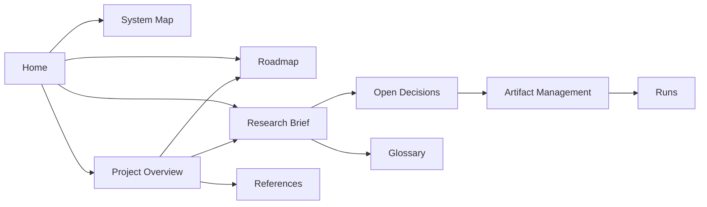

# Self-Evolving Organism

> [!abstract] Vault hub
> Research vault for **digital organisms** that rewrite their own code through experience + **trainable weights**, assisted by an **NVIDIA NIM free-endpoint LLM pool**, with bodies you can monitor.
>
> **Repo:** [F3rNaNDEZ57/self-evolving-organism](https://github.com/F3rNaNDEZ57/self-evolving-organism) · **Phase 2** mutate/ablate/weights  
> **Canvas:** [[System Map]] (dashboard)  
> **Process:** after every task → vault + canvas ([[Working Rules]] · repo `AGENTS.md`)

---

## Start here

| Order | Note | Why |
|------:|------|-----|
| 0 | [[System Map]] | **Project dashboard** (status · next · architecture) |
| — | [[Working Rules]] | **After every task:** update vault + canvas |
| 1 | [[Project Overview]] | What we're building, why, status |
| 2 | [[Roadmap]] | Phases 0–6, milestones |
| 3 | [[Research Brief]] | Scientific object (schema, fitness, safety) |
| 4 | [[Open Decisions]] | D1–D12 locked freeze |
| 5 | [[Artifact Management]] | SQLite + disk + Obsidian lab pattern |
| 6 | [[Glossary]] | Shared vocabulary |
| 7 | [[References]] | Papers, systems, links |
| 8 | [[Phase 1 Research Package]] | NIM pins · literature · Docker containment · pre-reg |
| 9 | [[NIM Pin Log]] | Live-verified model ids + Docker smoke |
| 10 | [[Phase 2 Scaffold]] | Package layout, CLI, smoke results, next slices |
| 11 | [[GitNexus]] | Code intelligence index (1013 symbols, 82 flows) |

---

## Map of content

### Core

- [[System Map]] — **dashboard** (must stay current)
- [[Working Rules]] — vault + canvas after every task
- [[Project Overview]] — vision, pillars, status
- [[Roadmap]] — phased plan
- [[Research Brief]] — v0 freeze detail

### Decisions & storage

- [[Open Decisions]] — locked D1–D12 + amendments
- [[Artifact Management]] — three-layer storage

### Reference

- [[Glossary]] — terms
- [[References]] — external sources

### Lab notebooks (empty until experiments)

- [[Phase 5 Population]] — elite archive + mutate parent picker
- [[Phase 6 Hardening]] — doctor + research-grade checklist
- [[Runs/README|Runs/]] — experiment write-ups
- [[Mutations/README|Mutations/]] — patch post-mortems
- [[Lineage/README|Lineage/]] — lineage narratives

### Later

- Phase 1 deliverables → [[Phase 1 Research Package]]
- Formal ADR pack (optional)
- `Runs/` experiment notes (Phase 2+)

---

## North-star question

> [!question] The only question that matters for v0
> What is the simplest organism that can improve its own code on a measurable task **without escaping the sandbox**?

---

## Quick status

| Field | Value |
|-------|-------|
| Stage | **Phase 5 done** · **Phase 6** rails + live soak + kernel CI |
| Code | best-of · diagnose · safety→Bc · soak/--live · package · CI |
| Science | **Bcw − B0 = +4.44** · thr 0.30 · success=True · holdout Bw lag on active |
| UI | [[Phase 4 Observer UI]] · [[Phase 5 Population]] · [[Phase 6 Hardening]] |
| Critic | soft_pass · truncated JSON retry |
| Weights | best-of · holdout · diagnose · keep-if-beats-b0 · **`--on-seed`** exp |
| Safety | Bcw→Bc when diagnose negative (`--force-bcw` override) |
| Ops | `seo doctor` · `seo soak` · `seo package` · `seo runs export` |
| Git remote | https://github.com/F3rNaNDEZ57/self-evolving-organism |
| Secrets | `.env` only (gitignored) |
| Next | Higher coder temp + denser mutate schedule · re-evolve from 28.76 |
| Propose | GLM-5.2 + history **verified** on evo_20b838b660 · explore temp next |
| Lab | [[Runs/2026-07-12-population-evo-20b838b660]] pins+history check |

| Lab | [[Runs/2026-07-12-population-evo-3731006908]] post-promote · [[Runs/2026-07-12-population-evo-e7bd5a260f]] first accept |
| Active + elite | **`g_c07765783a` @ 28.76** (promoted) |
| Multi-lineage | first accept then plateau hold at **28.76** |

---

## v0 freeze (one screen)

| ID | Lock |
|----|------|
| D1 | Grid body |
| D2 | Task multi-seed fitness |
| D3 | Whitelist genome modules |
| D4 | Episode summaries + event subsample |
| D5 | Memory + trainable weights + code mutation |
| D6 | NIM free endpoints only |
| D7 | SQLite + artifacts + Obsidian notes |
| D8 | Python |
| D9 | Subprocess + allowlist + timeouts |
| D10 | Single active lineage |
| D11 | No UI in Phase 2 (CLI + DB) |
| D12 | Open-ended survival deferred |

---

## How to use this vault

> [!tip] Obsidian habits
> - **After every task:** update vault + [[System Map]] ([[Working Rules]])
> - Open [[System Map]] as the **live project dashboard** (re-open/fit view after updates)
> - **Canvas layout:** keep section shape + spacing (Rule 2b in [[Working Rules]] / `AGENTS.md`) — ☑/☐ checklists, no overlaps
> - Prefer **wikilinks** `[[Note]]`
> - Tag with `#phase/0` … `#phase/6`
> - Experiment logs → `Runs/YYYY-MM-DD-…`
> - Kernel vs genome language → [[Glossary]]
> - No API keys in the vault

---

## Doc graph

